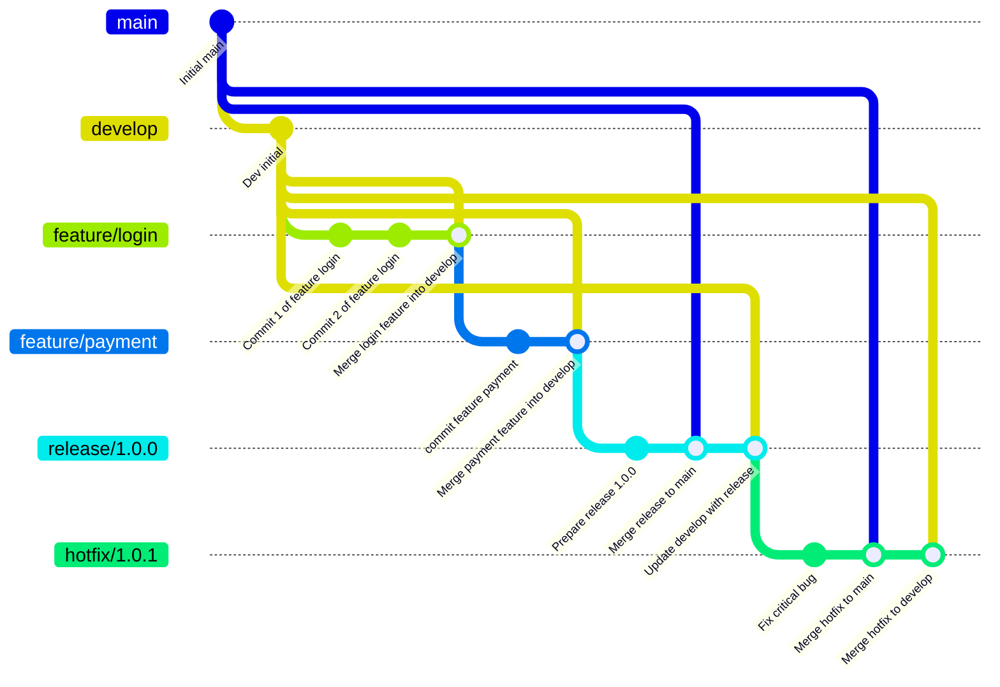

# 📝 Explication du workflow Git Flow + CI/CD

Le diagramme ci-dessous illustre le workflow **Git Flow** adapté aux pipelines **CI/CD** pour le projet actuel.

---

## 1️⃣ Branches principales

- **`main`**  
  Contient le code stable en production.  
  Chaque version déployée est **taguée** (`v1.0.0`, `v1.0.1`, ...).

- **`develop`**  
  Intègre toutes les fonctionnalités terminées.  
  Sert de base pour créer les releases.
 
 NB: Aucune modification directe n'est faite sur `main` ou `develop` sans passer par une pull request depuis la branche dédiée.

- **`release`**
  La branche release est créée à partir de `develop` pour préparer une nouvelle version stable.  
  Permet de finaliser les tests, corriger les bugs restants et mettre à jour la version du projet.

- **`feature/xxx`**
 La branche feature est la branche sur laquelle sont développées les nouvelles fonctionnalités. Cette branche est créée à partir de `develop`.

- **`hotfix/xxx`**
    La branche hotfix est utilisée pour corriger des bugs critiques en production. Cette branche est créée à partir de `main`.

---

## 2️⃣ Développement des fonctionnalités

- Les nouvelles fonctionnalités sont développées dans des branches **`feature/*`** dérivées de `develop`.
- Une fois le développement de la feature complète, il démarrer une nouvelle pull request depuis Github, celle-ci va lancer la pipeline par le **pull request validation**  afin de s'assurer que tout est ok (build + tests).
- Une fois terminée, la feature est **mergée dans `develop`**.

---

## 3️⃣ Préparation d’une release

- Une branche **`release/*`** est créée depuis `develop` pour préparer une nouvelle version stable.
- Elle permet de :
    - Finaliser les tests
    - Corriger les bugs restants
    - Mettre à jour la version du projet
- Une fois prête :
    - Merge dans **`main`** (production) et **`develop`**
    - Création d’un **tag** correspondant à la version (`vX.Y.Z`) sur `main`
- Le pipeline CD déploie automatiquement la version sur la production.

---

## 4️⃣ Correctifs urgents (hotfix)

- Pour corriger un bug critique en production :
    - Créer une branche **`hotfix/*`** depuis `main`
    - Appliquer le correctif
    - Merge dans **`main`** et **`develop`**
    - Création d’un **tag** sur `main`
- Le pipeline CD déploie immédiatement le correctif en production.

---

## 5️⃣ Cycle global

- Le workflow suit le schéma :

